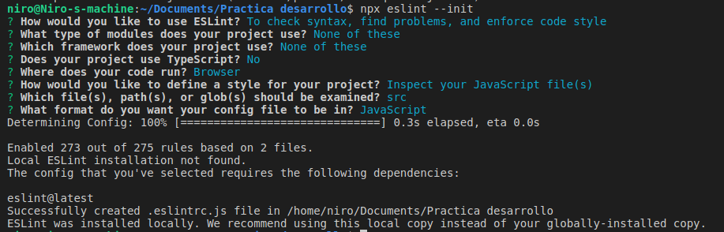

# Practice
A repo to practice different technologies
Different branches represents different practice projectsç

## How to recreate this template

- Optional: Set up the git repository. This will help documentation.
    
- Enable npm by creating a package.json.

    npm init

- Install Eslint

    npm install eslint

    npx eslint --init

    

- Create a hidden ignore file for eslint and add the folder node_modules

    echo "node_modules" >> .eslintignore

- Install Sass

    npm install node-sass

- Optional: Improve the package.json with [this](https://gist.github.com/IvanDerlich/6d764da8a0723b1b845bb858dd59f458) gist

## Usage

- Run eslint

      npx eslint .

- Fix linting errors automatically

      npx eslint . --fix

- How to run sass 

      rm -f src/styles/style.css &&  npx node-sass src/styles/sass/style.scss -o src/styles

      - The rm is needed otherwise it can't overwrite, the -f flag is to ignore the error when the file doesn't exist

- How to run sass in watchmode

      npx node-sass src/styles/sass/style.scss -o src/styles --watch

- How to open the website in the browser
git
      xdg-open ./src/index.html

- Run sass

      rm -f src/styles/style.css &&  npx node-sass src/styles/sass/style.scss -o src/styles

      - -f doesn't display error when file is not found
      - Input File: src/styles/sass/style.scss
      - Output Folder: src/styles
      - Be careful that one is a file and the other is a folder so the output file has the same name than the input file with the extension changed.
  
- Create a live version link using githack. Use that URL structure.

      https://raw.githack.com/user/repo/branch/file

      - Example:

      raw.githack.com/IvanDerlich/Practice/template-javascript/src/index.html

- Create a live version link publishing to github pages

      https://gist.github.com/IvanDerlich/9bef4a4a3f6d5cda37344e206f15573a